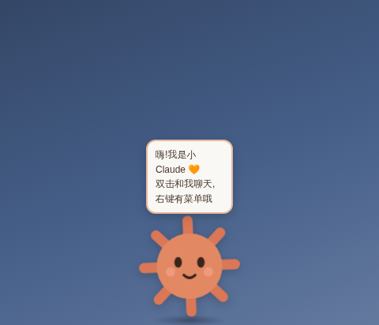

# 🧡 Claude 桌面宠物

一只住在你桌面上的小 Claude!基于 Electron 的透明置顶桌面宠物,会眨眼、散步、睡觉、卖萌,还能(可选地)接入 Claude API 陪你真·聊天。



> 这是一个粉丝自制项目,与 Anthropic 官方无关。

## ✨ 功能

- **透明无边框窗口**,始终置顶,悬浮在所有窗口之上
- **自主行为**:发呆、眨眼、左右散步、随机碎碎念、久不理它会睡着 💤
- **丰富互动**
  - 🖱️ 单击 —— 开心地蹦一下
  - 💬 双击 —— 打开聊天输入框
  - ✋ 按住拖拽 —— 把它拎到屏幕任何地方,松手后会掉回任务栏上方(带落地压扁动画)
  - 🥰 在它身上快速蹭鼠标 —— 摸头,会冒爱心
  - 📋 右键 —— 菜单(打招呼 / 散步 / 睡觉 / 聊天 / 退出)
- **点击穿透**:窗口透明区域不挡鼠标,只有宠物本体可以点到(Windows / macOS)
- **系统托盘**:显示 / 隐藏、置顶开关、退出
- **接入 Claude API 聊天**(可选):设置好 API Key 后,双击宠物即可和真正的 Claude 对话

## 🚀 运行

需要 Node.js 18+。

```bash
git clone https://github.com/krommhulton-del/my-first-project.git
cd my-first-project
npm install
npm start
```

## 💬 开启真·聊天(可选)

不设置也能玩,宠物会说内置的碎碎念。想让它接入 Claude 大脑:

```bash
# macOS / Linux
export ANTHROPIC_API_KEY=sk-ant-xxxx
npm start

# Windows (PowerShell)
$env:ANTHROPIC_API_KEY = "sk-ant-xxxx"
npm start
```

- 默认模型为 `claude-opus-5`,可用环境变量 `CLAUDE_PET_MODEL` 更换(例如 `claude-haiku-4-5` 更便宜更快)。
- 每次回复限制在 300 token 内,上下文只保留最近 12 条消息,日常闲聊花费很低。
- API Key 在 [platform.claude.com](https://platform.claude.com/) 获取。

## 🖥️ 浏览器预览

不想装 Electron?直接用浏览器打开 `renderer/index.html` 就能看到宠物的预览模式(带背景色,宠物在页面内散步,聊天功能不可用)。

## 📁 项目结构

```
├── main.js            # Electron 主进程:窗口、拖拽、托盘、菜单、Claude API
├── preload.js         # contextBridge 安全桥接
├── renderer/
│   ├── index.html     # 宠物本体(SVG 手绘小太阳)
│   ├── style.css      # 全部动画:呼吸、摇摆、走路、下落、压扁……
│   └── pet.js         # 行为状态机:idle / walk / drag / fall / sleep / happy / chat
├── scripts/
│   └── gen-icon.js    # 零依赖生成托盘图标 PNG
└── assets/icon.png    # 托盘 / 窗口图标
```

## 🛠️ 已知说明

- **Linux**:`setIgnoreMouseEvents` 的事件转发不受支持,因此 Linux 上窗口透明区域会拦截鼠标(窗口本身很小,影响不大);托盘依赖桌面环境支持。
- **macOS**:启动后会自动隐藏 Dock 图标,从托盘(菜单栏)管理。
- 想改宠物大小 / 颜色:改 `renderer/index.html` 里的 SVG 和 `main.js` 里的 `WIN_W / WIN_H` 即可。

## 📜 License

MIT
